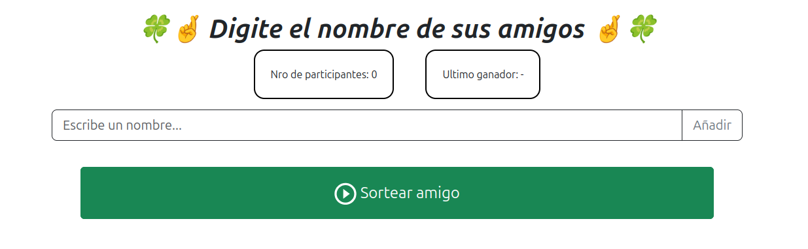

# :mag: JUEGO DEL AMIGO SECRETO :mag:

---

**Mira el resultado** :point_right: [Enlace](https://prieto-cristian.github.io/juego-amigo-secreto/) :eyes:

Proyecto propuesto por ONE (Oracle Next Education). La aplicacion permite a los usuarios ingresar nombres de amigos en una lista para luego realizar un sorteo aleatorio y determinar quien es el "**Amigo Secreto**".

## :hammer: FUNCIONALIDADES

* **Agregar nombres:** Los usuarios escribiran el nombre de un amigo en un campo de texto y lo agregaran a una lista visible al hacer click en "**Aniadir**".

* **Visualizar la lista:** Los nombres ingresados se mostraran en una lista debajo del campo de entrada.

* **Sorteo aleatorio:** Al hacer click en el boton **"Sortear Amigo"**, se seleccionara aleatoriamente un nombre de la lista y se mostrara en la pagina. Adicionalmente, tambien se sorteara un emoji que acompaniara al nombre sorteado :smile:.

* **Visualizar la cantidad de participantes:** El usuario puede ver el total de participantes registrados para el sorteo.

* **Eliminar participantes:** El usuario puede eliminar a un participante por medio de la lista que se le muestra.

* **Visualizar el ultimo ganador**

## :white_check_mark: VALIDACIONES

Cuando una validacion se activa, se mostrara una alerta roja arriba del campo de texto. Esta alerta detallara la causa del problema. A continuacion se detallan las validaciones realizadas:

* **Campos vacios:** Se valida que el usuario no pueda cargar campos vacios.

* **Nombre repetidos (exactamente iguales):** El usuario no puede cargar el mismo nombre 2 veces. Pero se permite ingresar el mismo nombre si difiere en mayusculas o minusculas del anterior.

* **Sorteos con minimo de participantes:** Los sorteos solo pueden comenzar cuando el usuario ingresa **al menos 2 participantes**.

## :computer: Tecnologias utilizadas

* HTML
* CSS
* JavaScript
* Bootstrap

## :bulb:Mejoras Futuras

* `Animacion tipo Rueda de la Fortuna o Maquina tragamonedas`
